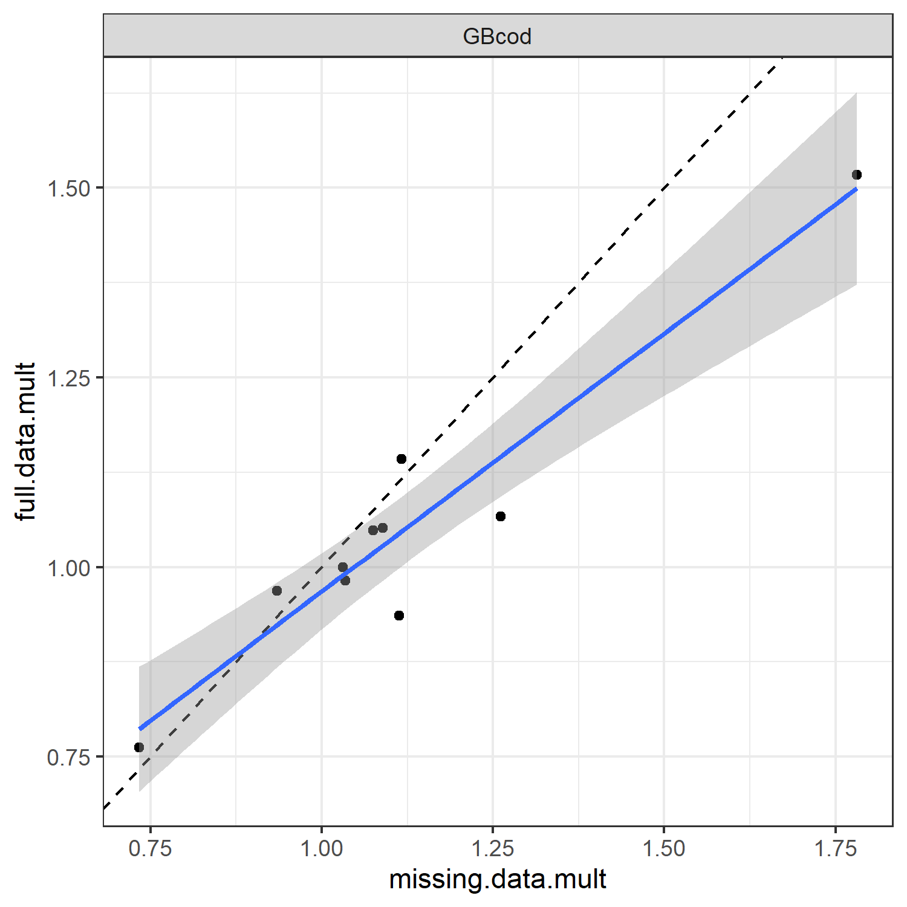
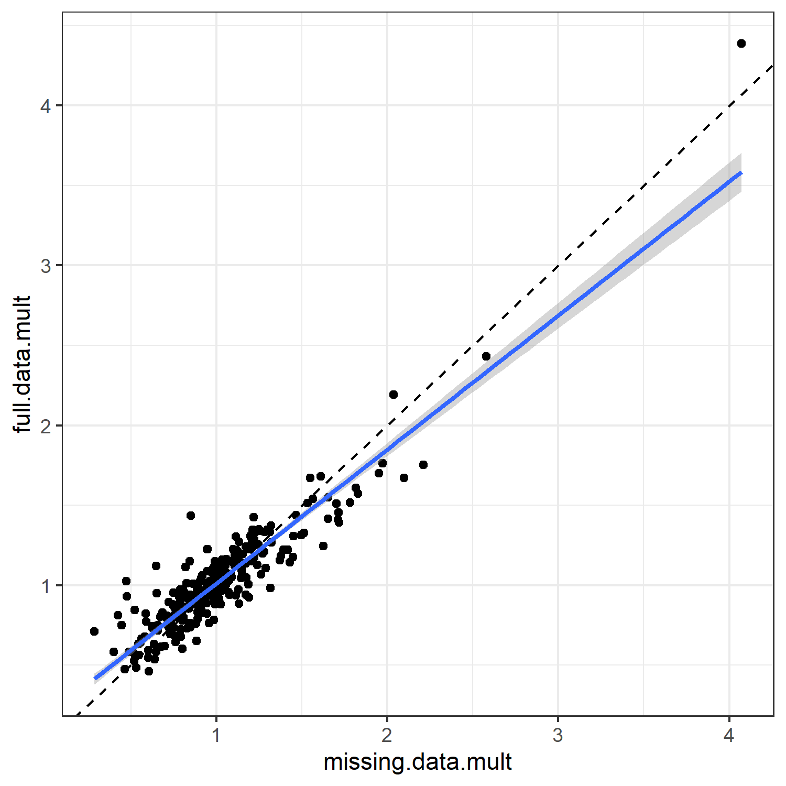

## Do the missing 2020 surveys create problems for PlanBsmooth?

Neither the NEFSC spring or fall survey was conducted in 2020 due to the covid pandemic. The 2021 management track for Georges Bank cod thus is faced with the last two years of the average survey time series having one survey only. This is because the fall survey is lagged by one year. For example, the spring 2019 and the fall 2018 surveys are averaged to form the average survey value for 2019. This means the 2020 average survey uses only the 2019 fall survey and the 2021 average survey uses only the 2021 spring survey. During the Assessment Oversight Panel (AOP) meeting, I suggested this balance in misssing information between the two surveys meant that the PlanBsmooth could be run as normal. The AOP noted (correctly) that missing information can cause many problems and that a test of this hypothesis should be conducted. This repository attempts to do so.

## What was done

A collection of survey data from actual stocks was collected. The PlanBsmooth approach was applied to these stocks with 10 different terminal years. For each terminal year, PlanBsmooth was run for the full data and then again for a situation that corresponds to the Georges Bank cod situation. The latter was created by removing the fall survey in the terminal year and the spring survey in the penultimate year. The PlanBsmooth multipliers were compared across the stocks and retrospective peels to look for consistency between the estimates. If strong consistancy was found, this would support the hypothesis that PlanBsmooth can provide reasonable catch advice even when there are two missing surveys at the end of the time series (the most important part of the time series for this method).

## Into the weeds

There are a set of four R scripts used for these analyses.

### 1_fetch_ADIOS_csv_files.R

This script gathers all the possible survey time series from the ADIOS collection. This script requires user to have access to the NEFSC network system to run. It is shown here for completeness. There were 76 files available when the script was run. However, not all of the stocks use both the NEFSC spring and fall survey and some of the stock settings were for only the Bigelow years. These files are not saved in the GitHub repository to save space and protect the innocent stocks. 

### 2_gather_data.R

This script pulls the NEFSC spring and fall survey data from each stock and ensures that both time series are available and of sufficient length for this analysis. It creates the file ADIOS_ALL.csv in the data directory. In this file, the fall time series has already been lagged (meaning the 2018 survey value appears on the row associated with Year = 2019). 

### 3_missing_data_retro.R

This script is the workhorse that applies PlanBsmooth to the orginal data and the data with the missing surveys. The original data can be easily analyzed with the RunRetro function of PlanBsmooth, while the missing data requires a by-hand calculation of the retrospective peels due to the changing years of missing data. Note the missing surveys are always the fall survey in the terminal year and the spring survey in the penultimate year, requiring not just peeling of the data but correct removal of the missing surveys. This script produces the file multipliers.csv in the data directory.

### 4_plot_results.R

This script is the fun part, making a number of plots comparing the mulitpliers from the two situations. In the plots showing missing.data.mult vs full.data.mult, each point is a combination of stock and terminal year, with each stock having a total of 10 points (terminal years 2010 through 2019). The dashed line is the y=x line which would show exact correspondance between the two multipliers. In plots that have it, the blue line with grey shaded area is a linear regression between the two multipliers. Different colored dots denote different stocks. Suggestions for addtional plots are welcomed!

## So what happened?

In my opinion, the missing data did not create a large problem for PlanBsmooth. The multipliers generally follow the y=x line across stocks and terminal years. There is a hint of more extreme values associated with the missing data multipliers, which is seen by a regression line that has slope less than one and crosses the y=x line near 1.0. This means that large values estimated by PlanBsmooth with missing data may not be quite that large, and small values may not be quite that small. However, these differences are relatively small compared to the range of multipliers seen within the 10 year peels for each stock. There are some interesting differences by both stock and terminal year that may be due to different ranges of observations (the differences are not as noticable when the same axes are used for all stocks or terminal years). However, the overall conclusion I draw is that applying PlanBsmooth to Georges Bank cod in the 2021 management track is appropriate.

## What do you think?

Feel free to make a pull request of this repository or email me (chris.legualt@noaa.gov) with your thoughts.

### These plots also available in plots directory

This plot shows the 10 retrospective peels for Georges Bank cod only.

Here are all 29 stocks together with 10 peels each.

Each stock has a different color in this plot.

Now each stock is its own plot with different axes for each stock.

Same plot as above except all stocks use the same axes.

Now the panels are terminal years and colors denote stocks.

Same plot as above except all terminal years use the same axes.
